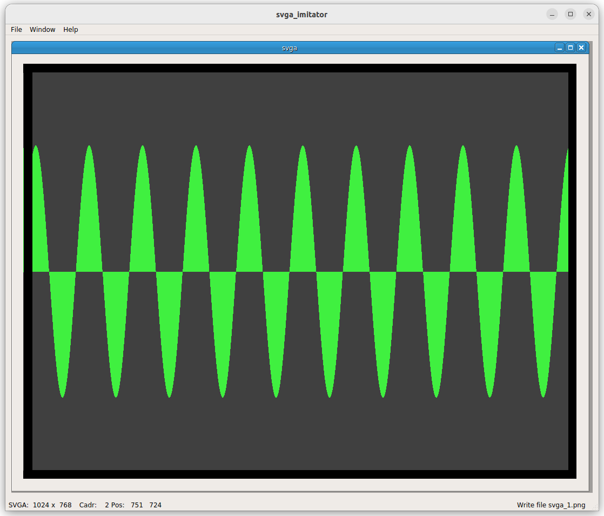
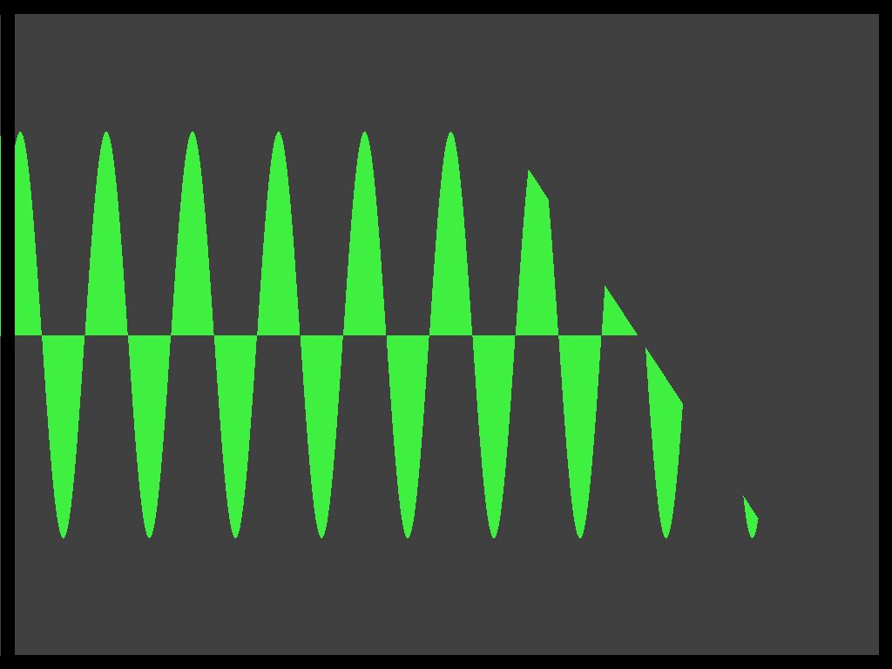
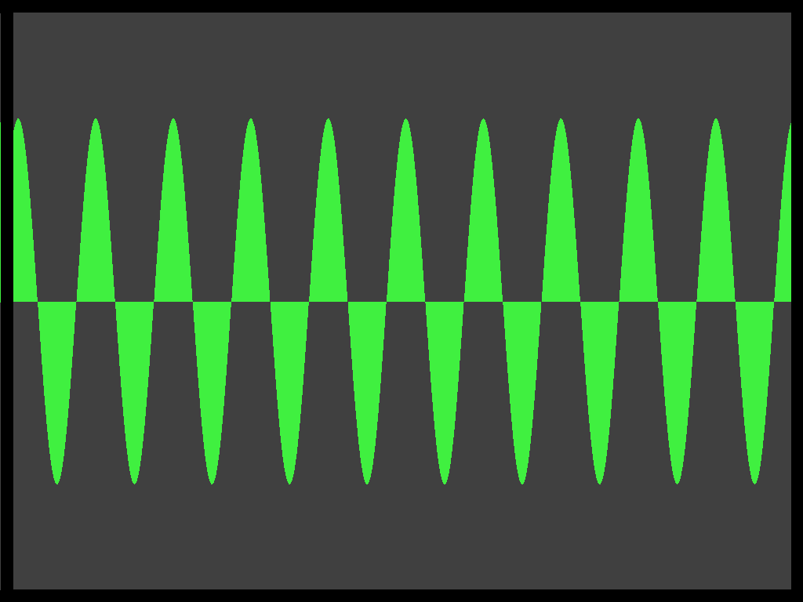

# SVGA_IMITATOR

Simulate output to SVGA from RTL simulator

* [README_rus](./README_rus.md) - Russian version

## Projects

* https://github.com/yuri-panchul/basics-graphics-music
* https://github.com/dsmv/2023-lalambda-fpga-labs
* https://github.com/dsmv/vivado_simulation_example

## Screenshots

### example svga_osc - Window (cadr 2)

### example svga_osc - cadr 0

### example svga_osc - cadr 1

### example svga_osc - cadr 2

