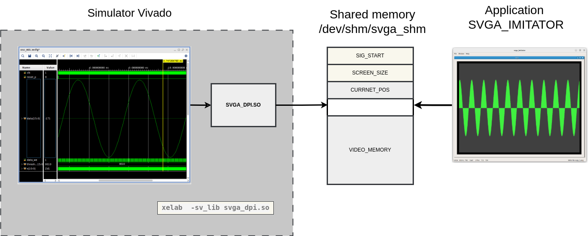

# SVGA_IMITATOR

Simulate output to SVGA from RTL simulator

* [README_rus](./README_rus.md) - Russian version

Results:
* application: SVGA_IMITATOR
* shared library for Vivado simulator: svga_dpi.so
* system verilog component: sim_svga
* examples for basics-graphics-music 

## Description

To simulate the display of an image on the monitor screen, the technology of connecting an external DLL to the RTL simulator via the DPI interface is used. Then the DLL uses shared memory to form a video buffer. The simulator program receives data from the shared memory and forms an image.

__General structure of the system__

It is necessary to start the simulator program and the simulation session separately. The simulation session can be restarted multiple times.
The program detects the fact of starting or restarting the RTL simulator and adjusts itself to the current screen resolution settings.

The simulator program is based on Cooperspice:  https://www.copperspice.com/

The Vivado simulator is used for simulation. Other simulators can be used, but they will require compiling other shared libraries.

The simulator program also generates image files for each received frame. File names: svga_nn.png, where nn is the frame number

## Screenshots

### example svga_osc - Window (cadr 2)

### example 2_1_rectangle_ellipse_parabola - Window 

### Others screenshots

* 2_1_rectangle_ellipse_parabola [2_1_rectangle_ellipse_parabola.md](./doc/2_1_rectangle_ellipse_parabola.md)
* svga_osc [svga_osc.md](./doc/svga_osc.md)

## Projects

The following projects are used:

* https://github.com/yuri-panchul/basics-graphics-music
* https://github.com/dsmv/2023-lalambda-fpga-labs
* https://github.com/dsmv/vivado_simulation_example

## Directory structure

The directory structure is the same as the basics-graphics-music project
* basics-graphics-music - RTL projects
    * boards - directories with projects for target boards
        * rzrd_svga - RZRD module with support for SVGA 1024x768 mode
    * labs - lab directories
        * 2_graphics - basic projects for working with graphics
            * 2_1_rectangle_ellipse_parabola - output of several figures
        * 99_svga - projects for SVGA 1024x768 mode
            * svga_osc - porting the lab_ext_svga_osc project from 2023-lalambda-fpga-labs
        * common - common files for synthesis
        * tb_common - common files for modeling
    * peripherals - common components
    * scripts - command files
* src - program code SVGA_IMITATOR
* svga_dpi_dll - code of the shared library svga_dpi.so
    * vivado - source code and build scripts for the Vivado system

## Build svga_dpi.so for Vivado system

File svga_dpi_dll/vivado/tb.sv contains descriptions of functions that should be implemented in an external DLL.

Build order:

* Run source ./env.sh - setting environment variables
* Run ./create_header.sh - the header file svga_dpi.h will be generated
* Check the function descriptions, if necessary, correct svga_dpi.cpp
* Run ./compile_dpi.sh - svga_dpi.so will be generated

A library boost is required for assembly.

The svga_dpi.so file must be included in the elaborate stage using the -sv_lib switch:

    xelab  -sv_lib ../../../../../../svga_dpi_dll/vivado/svga_dpi.so --incr -O0 --relax --mt 8 -L xil_defaultlib  --snapshot tb_behav tb -debug all     

## SVGA_IMITATOR build

Cooperspcie framework needs to be installed. Build is done using cmake.

## Simulation

Simulation is performed in the Vivado system. The test example is developed based on the vivado_simulation_example project.

It is necessary to prepare Vivado as specified in the document: https://github.com/dsmv/vivado_simulation_example/blob/main/README.md

Simulation is performed in the run_sim_vivado/sim_xx directory of the selected project. For the svga_osc example and the tb_01 test, the working directory will be: labs/99_svga/svga_osc/run_sim_vivado/sim_01

The run_sim_vivado/env.sh file is used to configure paths. When you first start the terminal, you need to run:

source ../env.sh

The file checks for the presence of the env_user.sh file, if such a file exists, it will be called. If the path or version of Vivado is different, you need to create the env_user.sh file from the env_user.sh.in file and specify the correct path to the settings64.sh file there

For successful execution of elaborate.sh, a compiled svga_dpi.so library is required

Command files:

* compile.sh - source code compilation. The systemverilog.sh file contains a list of files to compile
* elaborate.sh - project assembly
* c_run_0.sh - running simulation in command line mode
* g_run.sh - running Vivado in GUI mode
* g_run.tcl - command to restart the simulation session.

## Visual Studio Code workflow

* Open labs/99_svga/svga_osc/run_sim_vivado/sim_01 directory in Visual Studio Code built-in terminal
* Perform setup for the modeling system: source ../env.sh
* Perform compilation: ./compile.sh
* Perform assembly: ./elaborate.sh
* Launch Vivado in GUI mode:
    * Open labs/99_svga/svga_osc/run_sim_vivado/sim_01 directory (Open Container Folder)
    * Open terminal
    * Run: ./g_run.sh
    * Launch modeling session 

To restart the modeling session:
* Actions in Visual Studio Code built-in terminal (it is assumed that it is open and source ../env.sh is executed there)
    * Perform compilation: ./compile.sh
    * Perform the build: ./elaborate.sh
* Actions in Vivado GUI:
    * Run the relaunch_sim command via the icon in the Toolbox line. It is assumed that the preparation has been completed in accordance with the instructions in the vivado_simulation_example project
    * Run the simulation session 

Before running relaunch_sim, you must save all changes in the time diagram windows.

You can add instructions to open new time diagram windows to the g_run.tcl file. To add, use the -view <name>.wcfg parameter
